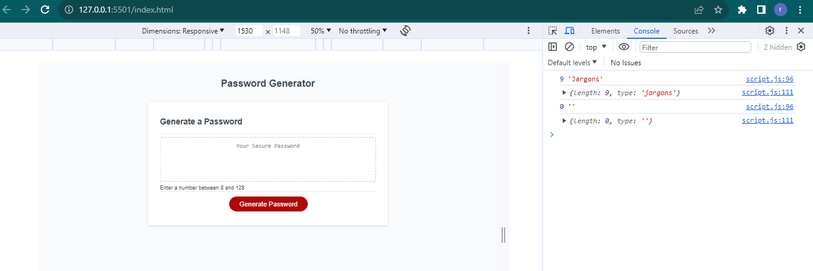

# passWordGenerator
an application that enable a user  can use to generate a random password based on criteria that is  selected.

## Description
An app that runs in the browser and features dynamically updated HTML and CSS, all powered by JavaScript code that you will write.The  app will has a clean and polished user interface that is responsive, ensuring that it adapts to multiple screen sizes.

## Installation
N/A

## Credit
https://developer.mozilla.org/

https://www.w3schools.com/

https://stackoverflow.com/

https://developer.mozilla.org/en-US/docs/Web/JavaScript

## Built with
HTML5 CSS JAVASCRIPT

## License
N/A

##

